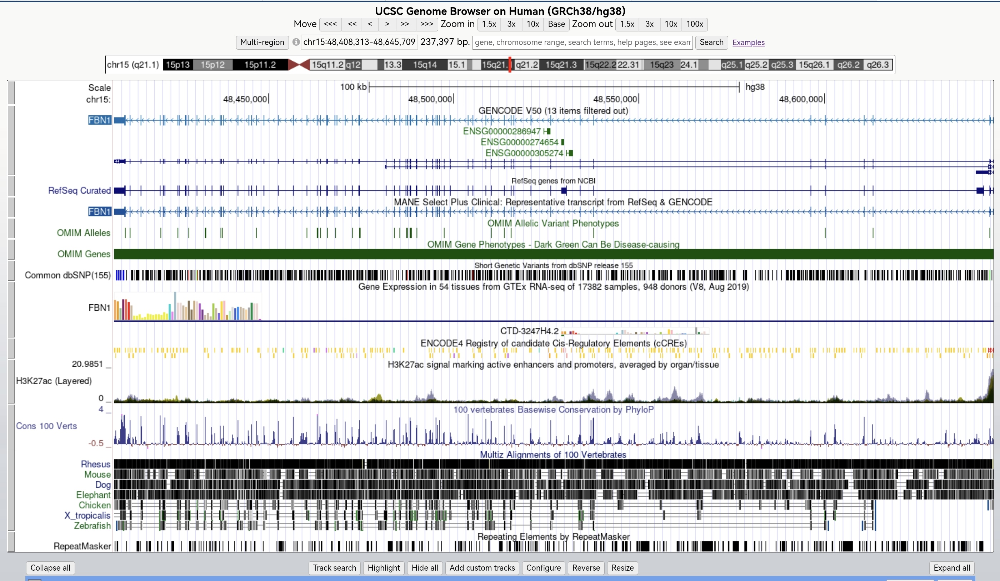
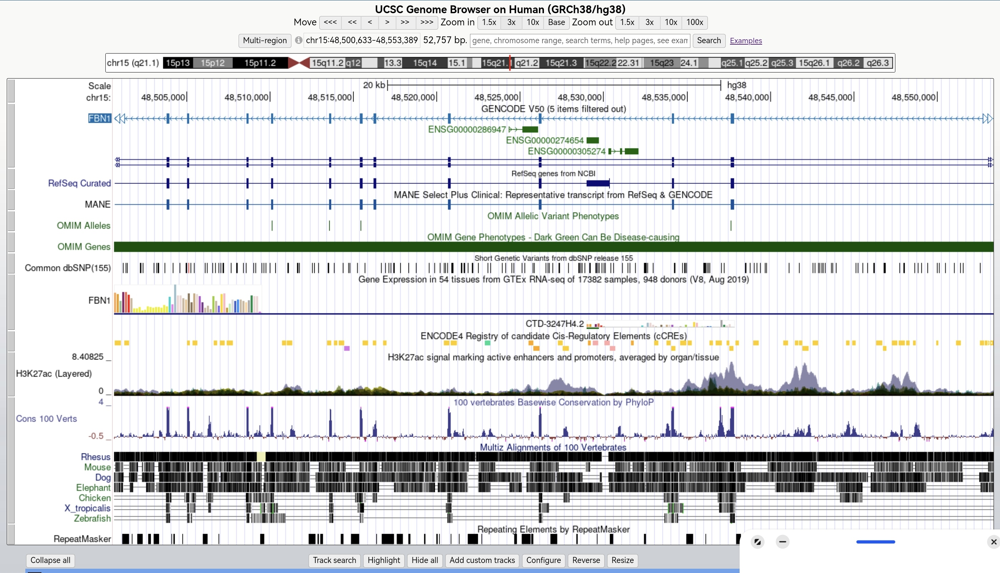
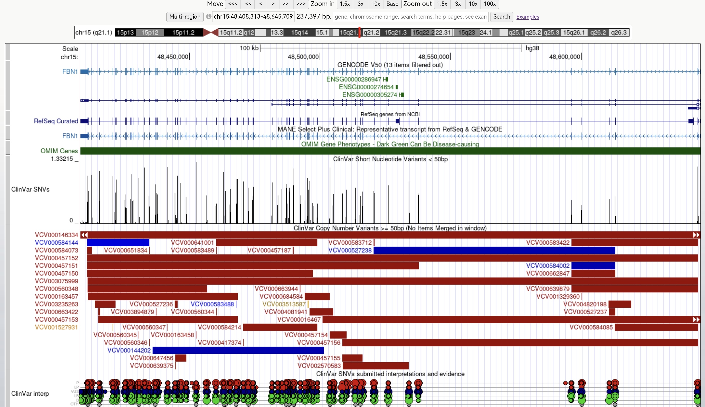
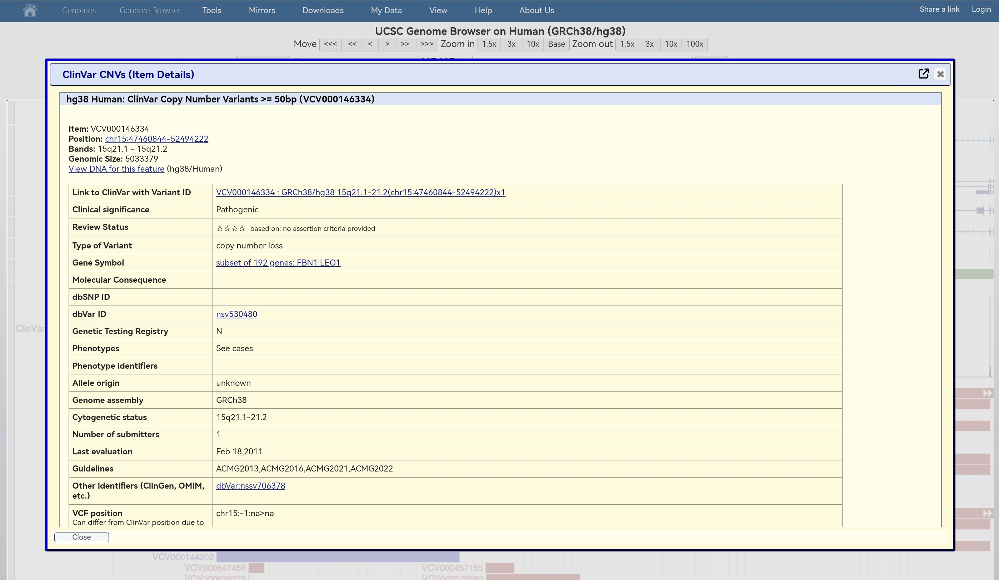
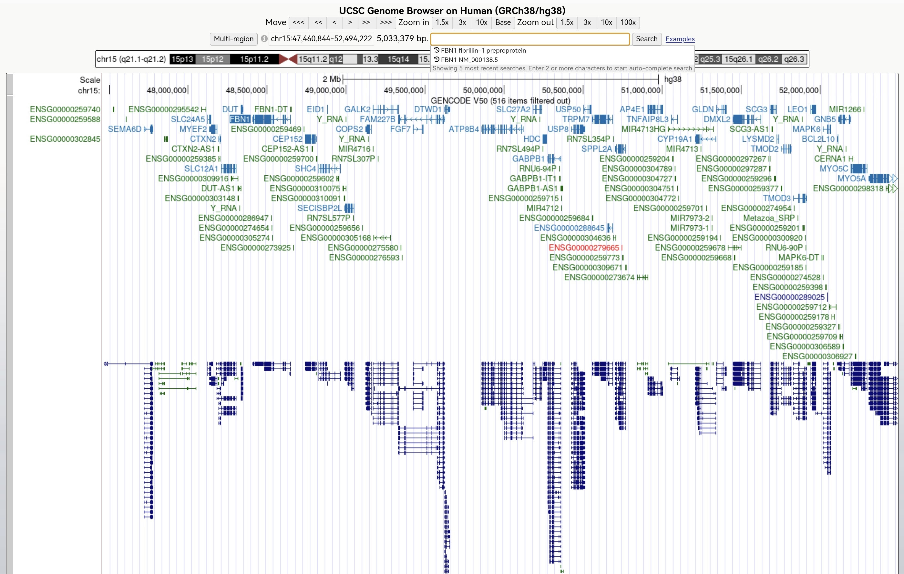

# Title: Exploring a Human Disease Gene Using UCSC Genome Browser and NCBI ClinVar

## Name: Jade Angela B. Suan

## Assigned Gene: FBN1

## Associated disease: Marfan syndrome

## Genome assembly: GRCh38/hg38

## Date: 2026-09-25

---------------

## Part A. Create Your Github Activity Record

---------------

## Part B — Gene Location in UCSC Genome Browser

| Item | Recorded Information |
|---|---|
| Official gene symbol | FBN1 |
| Full gene name | Fibrillin 1 |
| Chromosome | 15 (q21.1) |
| Genome assembly | GRCh38/hg38 |
| Genomic coordinates | chr15:48,408,313 – 48,645,709 |
| DNA strand | − (minus/reverse strand) |
| Approximate gene size | ~237.4 kbp (237,397 bp) |

**Screenshot 1 — Gene Location:**

-----------------
## Part C — Gene Structure: Exons, Introns, Transcripts

| Item | Answers |
|---|---|
| Annotation track used | MANE Select Plus Clinical / RefSeq Curated |
| Selected transcript | NM_000138.5 (MANE Select) |
| Number of exons | 65 |
| Multiple isoforms visible? | Yes — GENCODE shows 5 filtered; RefSeq has separate rows too |
| Difference between Exon and Intron | Exons are the coding regions of a gene that carry the instructions for making proteins, while introns are the non-coding regions that sit between exons and get cut out |
| Intron vs exon length | Introns are much longer — exons are small boxes separated by long lines |

**Screenshot 2 — Gene Structure:**

---------

## Part D — Annotation Tracks, ClinVar Variants & Conservation

| Item | Answers |
|---|---|
| Annotation tracks displayed | MANE Select Plus Clinical, RefSeq Curated, GENCODE V50, OMIM Genes, ClinVar Variants, ClinVar SNVs, ClinVar interp, Cons 100 Verts |
| ClinVar variants visible | Yes — numerous red bars and red circles indicate pathogenic/likely pathogenic variants associated with FBN1 |
| Conservation track name | Cons 100 Verts — 100 vertebrates Basewise Conservation by PhyloP |
| Conservation pattern | Strongest conservation peaks align directly with exon positions; intron regions show low/flat conservation |
| Are some regions more conserved than others? | Yes — exons are highly conserved across vertebrates; introns show very little conservation |
| Why exons are more conserved | Exons encode the protein sequence — changes here disrupt fibrillin-1 function and are selected against during evolution. Introns are removed during splicing so their sequence matters less |
| Biological significance | Red pathogenic variants fall in highly conserved regions → confirms these sequences are functionally critical. Mutations here cause Marfan syndrome by impairing fibrillin-1 structure or function |

**Screenshot 3 — ClinVar & Conservation Tracks:**

---
## Part E — ClinVar Variant Details

| Item | Recorded Information |
|---|---|
| Selected ClinVar Variant ID | VCV000146334 |
| Genome Assembly | GRCh38 / hg38 |
| Genomic Coordinates | chr15:47460844–52494222 |
| Cytogenetic Location | 15q21.1–q21.2 |
| Gene Symbol | FBN1 (Fibrillin 1) |
| Variant Classification | Copy Number Variant — **Deletion / Loss** |
| Variant Size | ~5,033,379 bp (5.0 Mb) |
| Clinical Significance | **Pathogenic** |
| Associated Phenotype | Marfan syndrome |
| Mechanism of Pathogenicity | Large gene deletion removes substantial portion of FBN1 → haploinsufficiency — insufficient functional fibrillin-1 → weakened extracellular matrix → Marfan features |
| Inheritance Pattern | Autosomal Dominant — one altered copy causes disease |
| Submission/Review Status | Reported Feb 2011; 1 submitter; classification: Pathogenic |

**Screenshot 4 — ClinVar Variant Details:**

---
## Part F — Variant Position & Functional Impact in UCSC

| Question | Answer |
|---|---|
| a. Variant location relative to FBN1 | Spans the entire FBN1 gene locus — coordinates chr15:47460844–52494222 (GRCh38/hg38). Covers the gene from upstream/promoter region through most exons to downstream sequence. |
| b. Genomic region classification | Not limited to one region — this copy-number deletion **encompasses multiple exons, all intervening introns, 5' and 3' flanking/regulatory regions** of FBN1. |
| c. Coding vs non-coding involvement | Affects **both**: removes protein-coding exons as well as non-coding introns, untranslated regions, and regulatory sequences. |
| d. Predicted effect on gene/gene product | **Loss-of-function via deletion**: ~5.0 Mb deletion eliminates a large portion of the FBN1 gene. Transcription cannot produce a full functional mRNA; any truncated product is non-functional. Result = **haploinsufficiency** — one functional copy absent → insufficient fibrillin-1 protein → impaired extracellular matrix integrity → Marfan syndrome. |
| e. Additional evidence to confirm causation | • Confirm deletion breakpoints and that FBN1 coding sequence is lost (WGS/CGH) • Show variant segregates with disease in family members • Demonstrate reduced/absent fibrillin-1 expression in patient cells/tissue • Exclude other pathogenic FBN1 variants in trans • Corroborate with published literature and independent case reports |

**Screenshot 5 — Variant in Genome Context:**

---
## Part G — Short Reflection

**1. What did UCSC show about your gene not obvious from reading?**
UCSC revealed that FBN1 is an extremely large gene — 65 exons separated by very long introns — far bigger and more spread out than just reading the name suggests. I also saw that coding exons are highly conserved across vertebrates, while introns change freely, showing which regions are functionally critical.

**2. Why is exact genomic location useful?**
It pinpoints whether a variant falls in an exon, intron, UTR, or regulatory sequence. This directly suggests how it might affect the gene — changing protein sequence, splicing, or expression. Exact coordinates also let researchers compare variants between patients and link findings across studies.

**3. Limitation of predicting effect from location only?**
Location alone cannot confirm functional impact. A coding change might not harm protein function, while a non-coding variant could disrupt splicing or regulation. You also cannot determine protein expression levels or in vivo behavior from position alone.

**4. Most interesting feature observed?**
Conservation peaks aligned perfectly with exon positions — like a biological marker of importance. This overlapped with where pathogenic ClinVar variants cluster, clearly showing that the most preserved DNA regions are exactly where disease-causing mutations occur in FBN1.

